# 💫 About Me:

Hi, I'm Dhruv Rajkotia 👋 — an AI Solution Architect who designs and ships production-grade conversational AI. I build LLM-powered agents end to end: multi-step agentic workflows with LangGraph, real-time voice agents on LiveKit/WebRTC, and document-intelligence pipelines that turn messy real-world inputs into structured, validated data. Full-stack when it counts — Python/FastAPI on the back, Next.js/TypeScript/ReactJS on the front, MongoDB and AWS/GCP underneath.

🔭 I'm currently working on: production conversational AI — LLM copilots, real-time voice agents, and multi-step agentic workflows orchestrated with LangGraph 
👯 I'm looking to collaborate on: open-source agent tooling, AI web operators / browser-automation agents, and MCP-based integrations 
🤝 I'm looking for help with: hardening multi-agent systems — evals, reliability patterns, and guardrails at scale 
🌱 I'm currently learning: computer-use & web-operator agents, Model Context Protocol (MCP), and eval tooling 
💬 Ask me about: conversational AI, LangChain/LangGraph, RAG, voice agents (LiveKit/WebRTC), FastAPI, MongoDB, AWS 
⚡ Fun fact: I don't browse the web anymore — my agents do it for me

## 🌐 Socials:
  

# 💻 Tech Stack:
                                                           

# 📊 GitHub Stats:

<h3><code>dhruv@github ~ $ ./contributions.sh</code></h3>

  

<h3><code>dhruv@github ~ $ whoami</code></h3>

---

<!-- Proudly created with GPRM ( https://gprm.itsvg.in ) -->
<!--
The stats section is animated SVG generated by scripts/ — no tokens, no
third-party services. The heatmap refreshes daily via GitHub Actions.
Regenerate the card after editing:
  python scripts/make_info_card.py
-->
